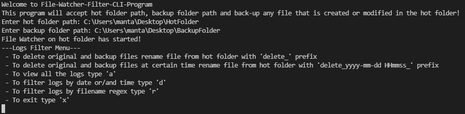

# File-Watcher-Filter-CLI-Program

Project is organized of 2 classes, 1 namespace and maip.cpp. Namespace CLI is responsible for user input and filtered log outputs to the console window. Logger class is responsible for writing/reading logs data of 'hot folder' and 'backup folder' files. FileWatcher class is for handling/monitoring 'hot folder' and 'backup folder' files. Files monitoring is running on separate thread. 

This program will accept 'hot folder' path, 'backup folder' path and back-up any file that is created or modified in the hot folder. Programs functionality:
 - backup files will have the same name as the original file, just with .bak extension
 - if the file name is prefixed with 'delete_' it will be deleted from the 'hot folder' and 'backup folder'
 - if the file name is prefixed with 'delete_yyyy-mm-dd HHmmss_' it will be deleted from the 'hot folder' and 'backup folder' at certain date/time
 - all actions taken by program (file created, modified, backedup or removed) are saved to the log file
 - log file can be viewed this program
 - log file can be filtered by date and filename regex
 - after first program's boot, 'hot folder' and 'backup folder' paths are saved to settings file
 - all info from logs, 'hot folder' and 'backup folder' are loaded when program started again (program keeps it's state between reboots)
 - program is using non-blocking IO

## Dependencies for Running Locally
* cmake >= 3.20.4
  * All OSes: [click here for installation instructions](https://cmake.org/install/)
* msbuild >= 16.11 
  * Windows: [install visual studio 2019](https://visualstudio.microsoft.com/downloads/)

## Instructions

1. Clone the project repository: `https://github.com/tasmanx/File-Watcher-Filter-CLI-Program.git`
2. Make a build directory in the top level directory: `mkdir build` and `cd build`
3. Compile: `cmake ..` and `msbuild .\File-Watcher-Filter-CLI-Program.sln`
4. Run it: `.\Debug\File-Watcher-Filter-CLI-Program.exe`

